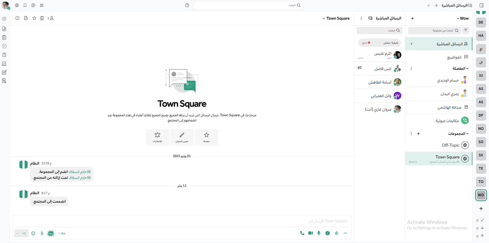

# 

[Workspace](https://workspace.com) is an open core, self-hosted collaboration platform that offers chat, workflow automation, voice calling, screen sharing, and AI integration. This repo is the primary source for core development on the Workspace platform; it's written in Go and React, runs as a single Linux binary, and relies on PostgreSQL. A new compiled version is released under an MIT license every month on the 16th.

[Deploy Workspace on-premises](https://workspace.com/deploy/?utm_source=github-workspace-server-readme), or [try it for free in the cloud](https://workspace.com/sign-up/?utm_source=github-workspace-server-readme).

Learn more about the following use cases with Workspace:

- [DevSecOps](https://workspace.com/solutions/use-cases/devops/?utm_source=github-workspace-server-readme)
- [Incident Resolution](https://workspace.com/solutions/use-cases/incident-resolution/?utm_source=github-workspace-server-readme)
- [IT Service Desk](https://workspace.com/solutions/use-cases/it-service-desk/?utm_source=github-workspace-server-readme)

Other useful resources:

- [Download and Install Workspace](https://docs.workspace.com/guides/deployment.html) - Install, setup, and configure your own Workspace instance.
- [Product documentation](https://docs.workspace.com/) - Learn how to run a Workspace instance and take advantage of all the features.
- [Developer documentation](https://developers.workspace.com/) - Contribute code to Workspace or build an integration via APIs, Webhooks, slash commands, Apps, and plugins.

Table of contents
=================

- [Install Workspace](#install-workspace)
- [Native mobile and desktop apps](#native-mobile-and-desktop-apps)
- [Get security bulletins](#get-security-bulletins)
- [Get involved](#get-involved)
- [Learn more](#learn-more)
- [License](#license)
- [Get the latest news](#get-the-latest-news)
- [Contributing](#contributing)

## Install Workspace

- [Download and Install Workspace Self-Hosted](https://docs.workspace.com/guides/deployment.html) - Deploy a Workspace Self-hosted instance in minutes via Docker, Ubuntu, or tar.
- [Get started in the cloud](https://workspace.com/sign-up/?utm_source=github-workspace-server-readme) to try Workspace today.
- [Developer machine setup](https://developers.workspace.com/contribute/server/developer-setup) - Follow this guide if you want to write code for Workspace.

Other install guides:

- [Deploy Workspace on Docker](https://docs.workspace.com/install/install-docker.html)
- [Workspace Omnibus](https://docs.workspace.com/install/installing-workspace-omnibus.html)
- [Install Workspace from Tar](https://docs.workspace.com/install/install-tar.html)
- [Ubuntu 20.04 LTS](https://docs.workspace.com/install/installing-ubuntu-2004-LTS.html)
- [Kubernetes](https://docs.workspace.com/install/install-kubernetes.html)
- [Helm](https://docs.workspace.com/install/install-kubernetes.html#installing-the-operators-via-helm)
- [Debian Buster](https://docs.workspace.com/install/install-debian.html)
- [RHEL 8](https://docs.workspace.com/install/install-rhel-8.html)
- [More server install guides](https://docs.workspace.com/guides/deployment.html)

## Native mobile and desktop apps

In addition to the web interface, you can also download Workspace clients for [Android](https://workspace.com/pl/android-app/), [iOS](https://workspace.com/pl/ios-app/), [Windows PC](https://docs.workspace.com/install/desktop-app-install.html#windows-10-windows-8-1), [macOS](https://docs.workspace.com/install/desktop-app-install.html#macos-10-9), and [Linux](https://docs.workspace.com/install/desktop-app-install.html#linux).

        

## Get security bulletins

Receive notifications of critical security updates. The sophistication of online attackers is perpetually increasing. If you're deploying Workspace it's highly recommended you subscribe to the Workspace Security Bulletin mailing list for updates on critical security releases.

[Subscribe here](https://workspace.com/security-updates/#sign-up)

## Get involved

- [Contribute to Workspace](https://handbook.workspace.com/contributors/contributors/ways-to-contribute)
- [Find "Help Wanted" projects](https://github.com/workspace/workspace-server/issues?page=1&q=is%3Aissue+is%3Aopen+%22Help+Wanted%22&utf8=%E2%9C%93)
- [Join Developer Discussion on a Workspace server for contributors](https://community.workspace.com/signup_user_complete/?id=f1924a8db44ff3bb41c96424cdc20676)
- [Get Help With Workspace](https://docs.workspace.com/guides/get-help.html)

## Learn more

- [API options - webhooks, slash commands, drivers, and web service](https://api.workspace.com/)
- [See who's using Workspace](https://workspace.com/customers/)
- [Browse over 700 Workspace integrations](https://workspace.com/marketplace/)

## License

See the [LICENSE file](LICENSE.txt) for license rights and limitations.

## Get the latest news

- **X** - Follow [Workspace on X, formerly Twitter](https://twitter.com/workspace).
- **Blog** - Get the latest updates from the [Workspace blog](https://workspace.com/blog/).
- **Facebook** - Follow [Workspace on Facebook](https://www.facebook.com/workspaceHQ).
- **LinkedIn** - Follow [Workspace on LinkedIn](https://www.linkedin.com/company/workspace/).
- **Email** - Subscribe to our [newsletter](https://workspace.us11.list-manage.com/subscribe?u=6cdba22349ae374e188e7ab8e&id=2add1c8034) (1 or 2 per month).
- **Workspace** - Join the ~contributors channel on [the Workspace Community Server](https://community.workspace.com).
- **IRC** - Join the #matterbridge channel on [Freenode](https://freenode.net/) (thanks to [matterircd](https://github.com/42wim/matterircd)).
- **YouTube** -  Subscribe to [Workspace](https://www.youtube.com/@workspaceHQ).

## Contributing

Please see [CONTRIBUTING.md](./CONTRIBUTING.md).
[Join the Workspace Contributors server](https://community.workspace.com/signup_user_complete/?id=codoy5s743rq5mk18i7u5ksz7e) to join community discussions about contributions, development, and more.
